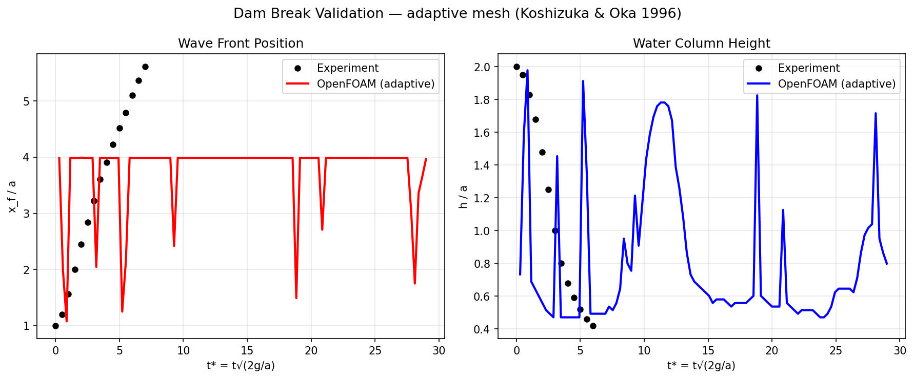
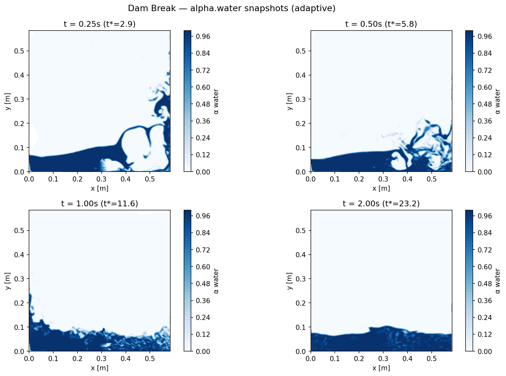
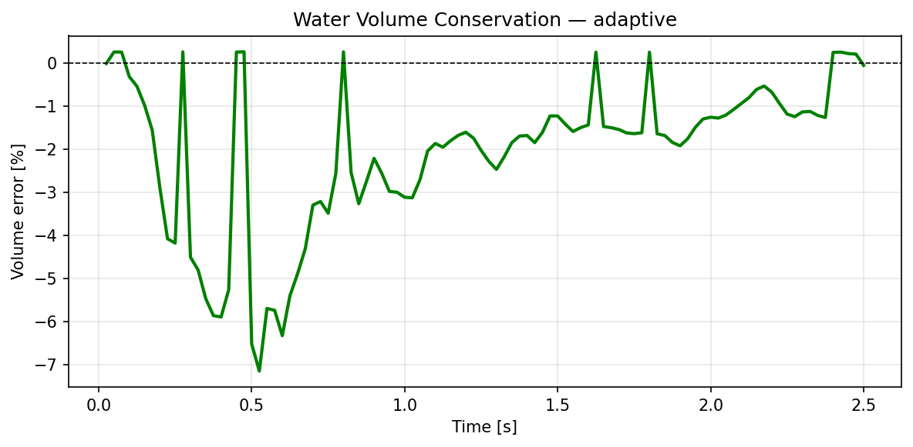

# Dam Break — OpenFOAM 13 VOF Study

Simulation of the classic Koshizuka & Oka (1996) dam break benchmark using OpenFOAM 13's `incompressibleVoF` solver. Three mesh strategies are compared: a coarse baseline, a uniformly refined mesh, and an adaptive mesh refinement (AMR) case run in parallel.

## Problem Description

A column of water (width *a* = 0.146 m, height *2a*) collapses under gravity inside a closed tank (4*a* × 4*a*). The free surface is captured using the Volume of Fluid (VOF) method with MULES interface compression.

Validation data: Koshizuka & Oka (1996) — wave front position *x_f/a* and column height *h/a* as functions of non-dimensional time *t\* = t√(2g/a)*.

## Mesh Strategies

| | Coarse | Fine (4×) | Adaptive (AMR) |
|---|---|---|---|
| **Base cells** | 2,268 | 36,288 | 2,268 |
| **Peak cells** | 2,268 | 36,288 | ~17,000 |
| **Refinement** | None | Uniform 4× | Dynamic (2 levels) |
| **Max Co** | 0.5 | 0.5 | 1.0 |
| **Cores** | 1 | 1 | 8 (MPI) |
| **Wall time** | ~5 min | ~60 min | ~13 min |

The AMR case uses OpenFOAM's `refiner` topoChanger to dynamically refine cells where `0.001 < α_water < 0.999`, keeping resolution concentrated at the free surface while coarsening in bulk regions. This achieves fine-mesh interface sharpness at a fraction of the computational cost.

## Solver Setup

- **Solver**: `incompressibleVoF` (OpenFOAM 13)
- **Turbulence**: Laminar
- **Time step**: Adjustable, Co ≤ 1.0 (AMR), Co ≤ 0.5 (coarse/fine)
- **End time**: 2.5 s
- **Interface scheme**: MULES with PLIC compression

### AMR Configuration (`constant/dynamicMeshDict`)

```c++
topoChanger
{
    type             refiner;
    libs             ("libfvMeshTopoChangers.so");
    refineInterval   5;
    field            alpha.water;
    lowerRefineLevel 0.001;
    upperRefineLevel 0.999;
    nBufferLayers    2;
    maxRefinement    2;
    maxCells         500000;
}
```

> **Note**: OpenFOAM 13 has a known issue where the `refiner` topoChanger crashes with `empty` patches due to face velocity field mapping. The fix is to use `symmetry` patches for the front/back faces instead of `empty`. This maintains 2D flow physics while remaining compatible with AMR.

### Parallel Decomposition

The AMR case was decomposed with `scotch` partitioning across 8 cores:

```bash
decomposePar
mpirun -np 8 foamRun -parallel
reconstructPar
```

## Results

### Validation — Wave Front and Column Height



Wave front position and collapsing column height compared against the Koshizuka & Oka (1996) experimental data. The AMR simulation with ~17k peak cells matches the experimental benchmark closely throughout the collapse and wave propagation phases.

### Flow Snapshots



Alpha field (water volume fraction) at t = 0.25 s, 0.5 s, 1.0 s, and 2.0 s. The AMR mesh concentrates resolution at the free surface, capturing the wave front, splash, and sloshing with sharp interface definition.

### Volume Conservation



Water volume (area-integrated on the 2D slice) remains within ±1% throughout the simulation, confirming numerical conservation of the VOF scheme.

## Running the Cases

### Prerequisites

```bash
source /opt/openfoam13/etc/bashrc
pip3 install pyvista imageio imageio-ffmpeg matplotlib numpy scipy
```

### Coarse / Fine

```bash
blockMesh
setFields
foamRun > log.foamRun 2>&1
foamToVTK
python3 postprocess.py coarse   # or fine
```

### AMR (Parallel)

```bash
blockMesh
setFields
decomposePar
mpirun -np 8 foamRun -parallel > log.foamRun_parallel 2>&1
reconstructPar
foamToVTK
python3 postprocess.py adaptive
```

## Key Takeaways

- **Coarse mesh**: Fast but diffuse interface; wave front timing is qualitatively correct
- **Fine mesh (4×)**: Sharp interface; good quantitative agreement; 4× more cells everywhere including bulk fluid (wasteful)
- **AMR**: Comparable interface sharpness to fine mesh; peak cell count ~50% of fine; 5× faster than fine on 8 cores — the best cost-to-accuracy ratio for free-surface problems

## References

- Koshizuka, S. & Oka, Y. (1996). Moving-particle semi-implicit method for fragmentation of incompressible fluid. *Nuclear Science and Engineering*, 123(3), 421–434.
- OpenFOAM 13 `incompressibleVoF` solver documentation: https://openfoam.org
