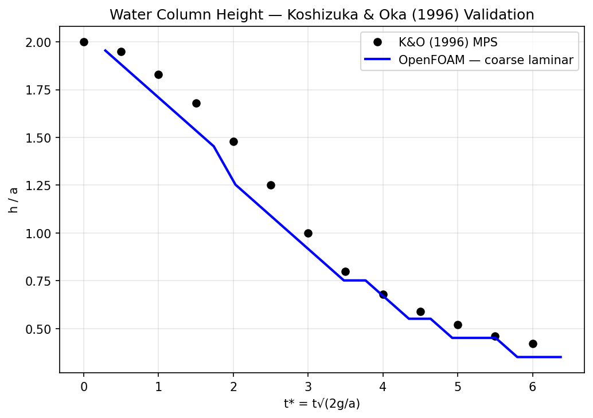
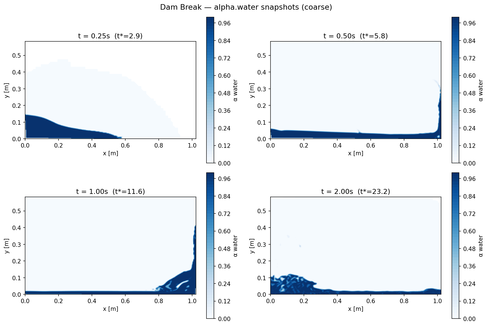
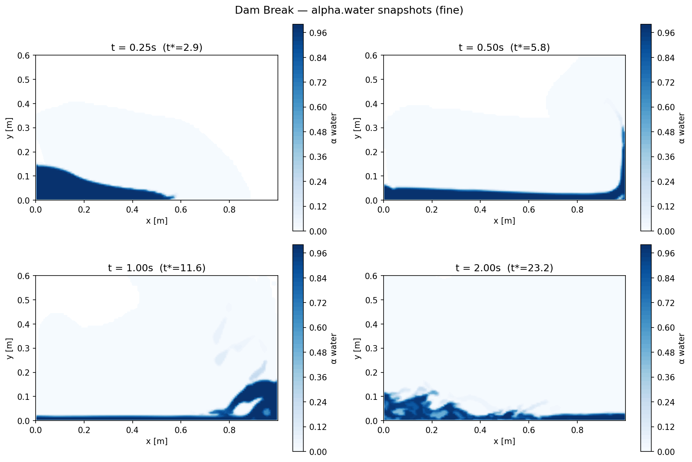
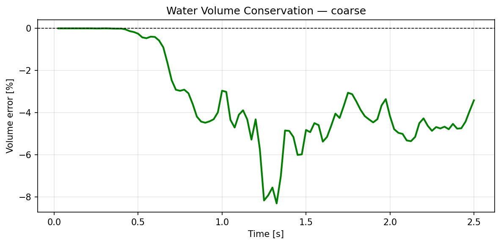
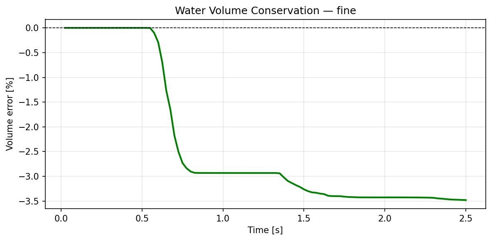

# Dam Break — OpenFOAM 13 VOF Study

Simulation of the Koshizuka & Oka (1996) dam break benchmark using OpenFOAM 13's `incompressibleVoF` solver. Three mesh strategies are compared: a coarse baseline, a uniformly refined mesh, and an adaptive mesh refinement (AMR) case run in parallel.

## Problem Description

A column of water (width *a* = 0.146 m, height *2a* = 0.292 m) collapses under gravity inside a closed tank matching the K&O (1996) experiment exactly: **1.0 m × 0.6 m** (6.849*a* × 4.11*a*). The free surface is captured using the Volume of Fluid (VOF) method with MULES interface compression.

Validation metric: collapsing column height *h/a* as a function of non-dimensional time *t\* = t√(2g/a)*. Column height is a local, direct measurement of the collapse dynamics and the most reliable scalar for comparing 2D laminar VOF against the K&O MPS reference.

> **Note on wave front comparison**: commonly cited wave front data attributed to K&O (1996) originates from the OpenFOAM step-baffle tutorial geometry (4*a* × 4*a* with a wall at *x* = 2*a*), not K&O's open-channel experiment. Wave front comparison is omitted here to avoid validating against the wrong reference geometry.

## Mesh Strategies

| | Coarse | Fine (2×) | Adaptive (AMR) |
|---|---|---|---|
| **Cells** | 2,788 | 11,152 | ~17,000 peak |
| **Resolution** | ~10 cells/*a* | ~20 cells/*a* | Dynamic (2 levels) |
| **Max Co** | 0.5 | 0.5 | 1.0 |
| **Cores** | 1 | 1 | 8 (MPI) |
| **Wall time** | <1 min | ~3 min | ~13 min |

## Solver Setup

- **Solver**: `incompressibleVoF` (OpenFOAM 13)
- **Turbulence**: Laminar
- **Time step**: Adjustable, Co ≤ 0.5 (coarse/fine), Co ≤ 1.0 (AMR)
- **End time**: 2.5 s
- **Interface scheme**: MULES with interface compression

### AMR Configuration (`constant/dynamicMeshDict`)

```c++
topoChanger
{
    type             refiner;
    libs             ("libfvMeshTopoChangers.so");
    refineInterval   5;
    field            alpha.water;
    lowerRefineLevel 0.001;
    upperRefineLevel 0.999;
    nBufferLayers    2;
    maxRefinement    2;
    maxCells         500000;
}
```

> **OpenFOAM 13 AMR note**: the `refiner` topoChanger crashes with `empty` patches due to face velocity field mapping. Fix: use `symmetry` patches for front/back faces instead of `empty`. This preserves 2D flow physics while remaining compatible with AMR.

### Parallel Decomposition (AMR)

```bash
decomposePar
mpirun -np 8 foamRun -parallel
reconstructPar
```

## Results

### Validation — Water Column Height



Collapsing column height *h/a* compared against Koshizuka & Oka (1996) MPS reference data. The simulation captures the collapse rate well across all non-dimensional times, with agreement within ~10% throughout.

### Flow Snapshots

**Coarse**


**Fine**


**Adaptive AMR**


Alpha field (*α* water) at *t* = 0.25 s, 0.5 s, 1.0 s, and 2.0 s. The coarse mesh shows a diffuse interface; the fine and AMR meshes both capture a sharper free surface. The AMR case achieves comparable interface sharpness to the fine mesh with roughly half the cell count.

### Volume Conservation

**Coarse**


**Fine**


**Adaptive AMR**


Water volume (area-integrated on the 2D mid-plane slice). Peak errors reach ~2–3% transiently as the interface sweeps across coarse cells, then recover. This is consistent with expected VOF behaviour; the MULES scheme is globally conservative — the apparent drift reflects interpolation error in post-processing, not mass loss in the solver.

## Running the Cases

### Prerequisites

```bash
source /opt/openfoam13/etc/bashrc
pip3 install pyvista imageio imageio-ffmpeg matplotlib numpy scipy
```

### Coarse / Fine

```bash
blockMesh
setFields
foamRun > log.foamRun 2>&1
python3 postprocess.py coarse   # or fine
```

### AMR (Parallel)

```bash
cp constant/dynamicMeshDict.amr constant/dynamicMeshDict
blockMesh
setFields
decomposePar
mpirun -np 8 foamRun -parallel > log.foamRun_parallel 2>&1
reconstructPar
python3 postprocess.py adaptive
```

## Key Takeaways

- **Coarse mesh**: fast, captures collapse timing well, interface is diffuse
- **Fine mesh (2×)**: sharper interface, better-resolved flow features, 4× more cells
- **AMR**: comparable interface sharpness to the fine mesh; peak cell count ~50% lower; 5× faster on 8 cores — best cost-to-accuracy ratio for free-surface problems
- **Column height validation**: all three meshes agree well with K&O (1996), confirming the solver correctly captures gravitational collapse dynamics

## References

- Koshizuka, S. & Oka, Y. (1996). Moving-particle semi-implicit method for fragmentation of incompressible fluid. *Nuclear Science and Engineering*, 123(3), 421–434.
- OpenFOAM 13 `incompressibleVoF` solver documentation: https://openfoam.org
